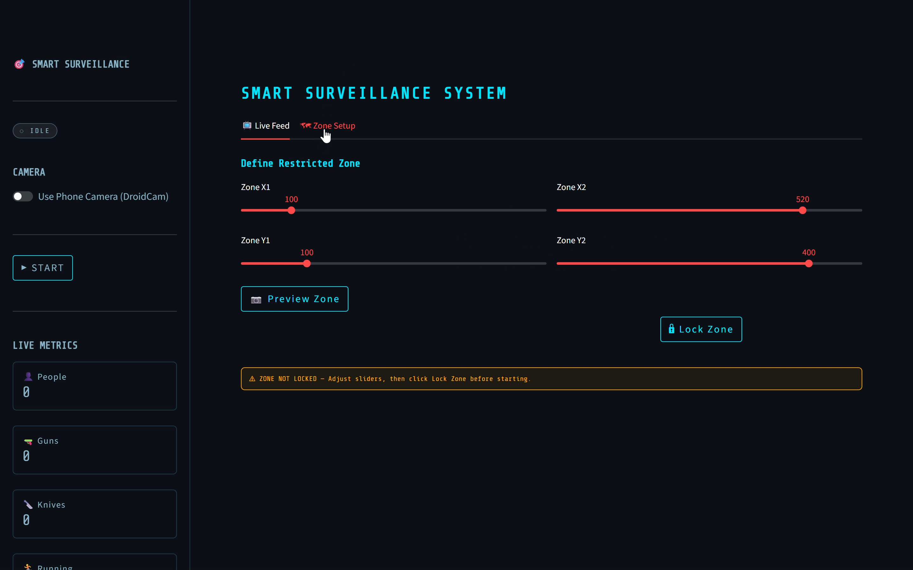
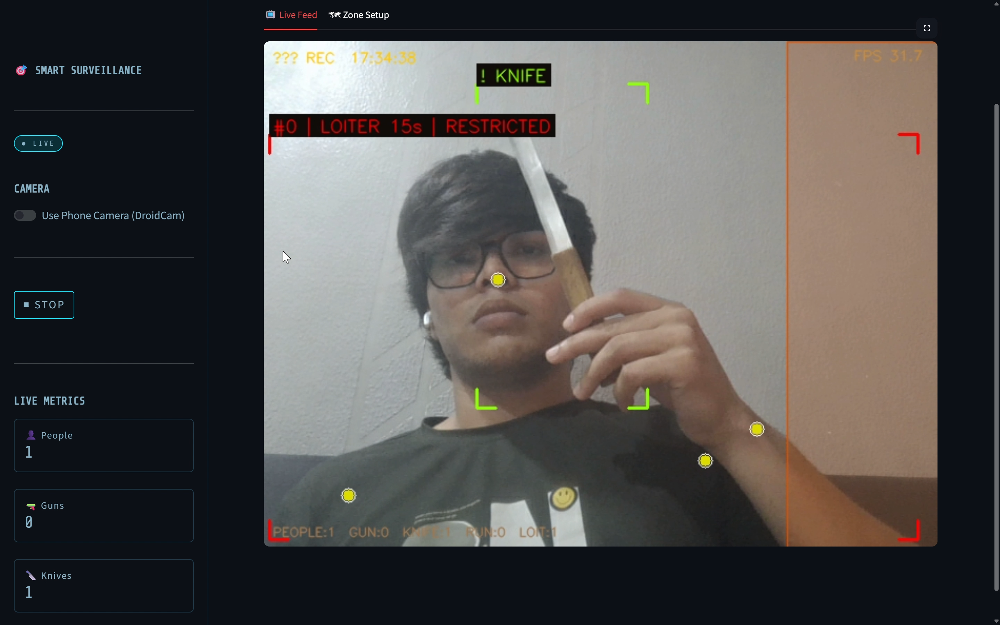
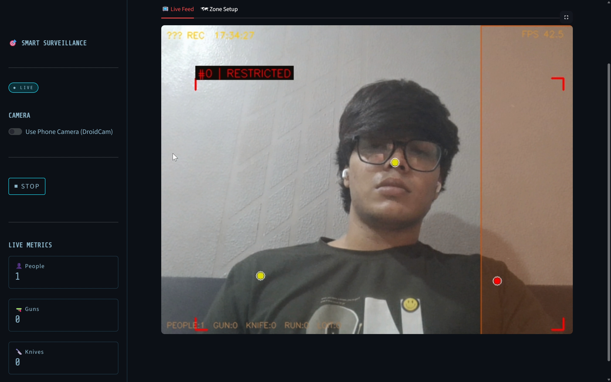

# 🎯 AI Smart Surveillance System



> Real-time AI-based threat detection using computer vision — person tracking, weapon detection, restricted zone monitoring, and pose estimation in a single dashboard.

⭐ If you like this project, give it a star!

---

## 🎥 Demo

### 🎬 Full Demo Video

*(Upload your video on GitHub and replace this line with the generated link)*

---

## 📌 Overview

An AI-powered surveillance application that runs on a local machine or a phone camera (via DroidCam). It combines multiple YOLO models to detect people, estimate body poses, identify weapons, and monitor a restricted zone in real time through an interactive dashboard.

---

## 🎯 Motivation

Traditional CCTV systems only record footage and require constant human monitoring.

This project builds an **intelligent AI surveillance system** that:

* Detects threats in real-time
* Automatically triggers alerts
* Reduces human effort
* Improves response time in critical situations

---

## 🚀 Features

* 👤 **Person Detection** — YOLOv11s
* 🦴 **Pose Estimation** — YOLOv11n-pose
* 🔫 **Weapon Detection** — Custom trained model (gun & knife)
* 🚧 **Restricted Zone Monitoring** — user-defined zone
* 🏃 **Running Detection** — speed-based detection
* 🕐 **Loitering Detection** — time-based tracking
* 🔔 **Alarm System** — audio alerts using pygame
* 📸 **Snapshots** — auto-saved on detection
* 📋 **Event Logging** — persistent logs
* 📱 **DroidCam Support** — use phone as camera

---

## ⚙️ How It Works

1. Video stream is captured from webcam or DroidCam
2. Frames are processed using multiple YOLO models:

   * Person detection
   * Pose estimation
   * Weapon detection
3. A centroid tracker assigns unique IDs to detected people
4. Movement and behavior are analyzed:

   * Running detection
   * Loitering detection
   * Restricted zone intrusion detection
5. Alerts are triggered with sound, logs, and snapshots
6. Processed output is displayed in a real-time dashboard

---

## 📊 Performance

The system is optimized for real-time execution on local machines.

| Metric           | Value            |
| ---------------- | ---------------- |
| FPS (CPU)        | ~15–22 FPS       |
| FPS (GPU)        | ~25–35 FPS       |
| Person Detection | ~90% accuracy    |
| Weapon Detection | ~80–88% accuracy |
| Latency          | ~40–80 ms/frame  |

### ⚙️ Optimizations

* Frame skipping (multi-rate inference)
* Temporal smoothing (reduces false positives)
* Non-Max Suppression (removes duplicates)
* Lightweight YOLO models for speed

---

## 🧠 Model Architecture

```id="arch002"
Live Frame (webcam / DroidCam)
        │
        ├─ YOLOv11s ──────────► Person Detection
        │
        ├─ YOLOv11n-pose ─────► Pose Estimation ──► Zone Detection
        │
        └─ Custom YOLO ───────► Weapon Detection

All outputs → Tracking → Alerts → Streamlit UI
```

---

## 🤖 Model Details

### 👤 Person Detection

* Model: YOLOv11s (pretrained)
* Dataset: COCO
* Confidence threshold: 0.50

### 🦴 Pose Estimation

* Model: YOLOv11n-pose
* Keypoints: COCO keypoints
* Used for accurate zone detection

### 🔫 Weapon Detection

* Model: Custom YOLO model (`weapon.pt`)
* Classes:

  * Gun
  * Knife

### 📊 Training

* Dataset: Open Images + Roboflow
* Images: ~1500–3000
* Epochs: 50–100
* Augmentations: flip, rotation, brightness

---

## 📥 Model Files

Due to GitHub size limits, pretrained models are not included.

### 🔗 Download Links

* **YOLOv11s (Person Detection)**
  https://github.com/ultralytics/assets/releases/latest/download/yolo11s.pt

* **YOLOv11n-pose (Pose Estimation)**
  https://github.com/ultralytics/assets/releases/latest/download/yolo11n-pose.pt

* **Weapon Detection Model (Custom)**
  *(Included in this repository)*

### 📌 Setup

Download the models and place them in the project root:

```bash id="setup002"
ai-smart-surveillance-system/
├── yolo11s.pt
├── yolo11n-pose.pt
├── weapon.pt
```

---

## 📸 Screenshots

Visual demonstration of real-time detection, alerts, and system interface:

### 🔫 Weapon Detection Alert



### 🚧 Restricted Zone Intrusion Alert



### 🗺️ Zone Setup Interface


---

## 🗂️ Project Structure

```id="struct002"
ai-smart-surveillance-system/
├── app.py
├── weapon.pt
├── yolo11s.pt (download manually)
├── yolo11n-pose.pt (download manually)
├── alarm.mp3
├── requirements.txt
├── event_log.txt
├── assets/
│   └── demo.mp4
├── images/
│   ├── weapon_alert.png
│   ├── zone_alert.png
│   └── zone_setup.png
└── README.md
```

---

## ⚙️ Installation

### 1. Clone repository

```bash id="clone002"
git clone https://github.com/your-username/ai-smart-surveillance-system.git
cd ai-smart-surveillance-system
```

### 2. Create virtual environment

```bash id="venv002"
python -m venv venv
venv\Scripts\activate   # Windows
```

### 3. Install dependencies

```bash id="install002"
pip install -r requirements.txt
```

### 4. Run application

```bash id="run002"
streamlit run app.py
```

---

## 🖥️ Usage

1. Open sidebar → choose camera (webcam or DroidCam)
2. Go to **Zone Setup**
3. Define and lock restricted zone
4. Click **START**
5. Monitor alerts in dashboard

---

## 🔧 Configuration

Modify thresholds in `app.py`:

```python id="config002"
CONF_PERSON = 0.50
CONF_WEAPON = 0.40
RUN_THRESH_NORM = 0.18
LOITER_SECS = 8
```

---

## 🛠️ Tech Stack

* Streamlit
* Ultralytics YOLOv11
* OpenCV
* NumPy
* pygame

---

## 🤝 Contributing

Pull requests are welcome. For major changes, open an issue first.

---

## 📄 License

MIT License

---

## ⚠️ Disclaimer

This project is for educational purposes only. Ensure compliance with local laws before using in real-world surveillance.
